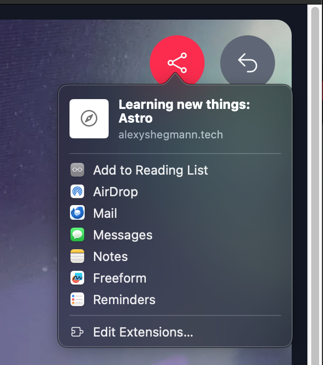

# Implementing a Share button in Astro

Sharing things we found on the internet is now a love language. Sure, you can copy the URL and paste it wherever you like, but when on mobile, popping up the address bar, selecting the damn thing, waiting for the "copy" option to appear, switching to the other app, hold-tapping the message field and clicking paste. Man!

This is why I wanted a share button. I want my users —you— to be happy.

## Quick recipe for implementing a Share button in Astro

The first thing we need is a new component. Create a new file `ShareButton.astro`. Make sure it receives the href and the title through props.

```astro
---
const { title, href } = Astro.props;
---

<button
  class="share-button"
  data-title={title}
  data-href={href}
>
  Share
</button>

<script>
  // You will write some code later on
</script>
```

You can style it however you want. Now that the trick is in the script we are going to add in the script tag:

```javascript
const btns = document.querySelectorAll(".share-button"); // <- Note that this uses the class I added previously to find all share buttons.
btns.forEach((btn) => {
  btn.addEventListener("click", async (e) => { // We attach a click listener to the button
    if (navigator.share) { // If we do have sharing capabilities in the browser
      await navigator.share({ // Trigger the share API with the data stored in the dataset
        title: e.currentTarget.dataset.title,
        url: e.currentTarget.dataset.href,
      });
    } else { // If we don't have share capabilities, copy to clipboard as a fallback
      await navigator.clipboard.writeText(
        `${e.currentTarget.dataset.title} - ${e.currentTarget.dataset.href}`
      );
      alert("URL Copied to clipboard.");
    }
  });
});
```

Now you can implement your component anywher you want and pass down the URL you want to share and the title:

```astro
---
import ShareButton from "./ShareButton.astro";
---

<ShareButton title="My Post title" href="https://mysite.com/my-post" />
```

## Caveats

Not all browsers implement this API. But according to [Can I use](https://caniuse.com/web-share) at the time I'm writting this post, 92% of the clients support it. That's a pretty high number. Just bear in mind each browser implements this in a different way. For example, Safari triggers a dropdown while Firefox mobile shows a drawer.



## Conclusion

It's easy to implement a share button. As long as you are triggering it in a [transient activation](https://developer.mozilla.org/en-US/docs/Glossary/Transient_activation), you can just call `navigator.share`. Remember to check if the browser supports it first, though!