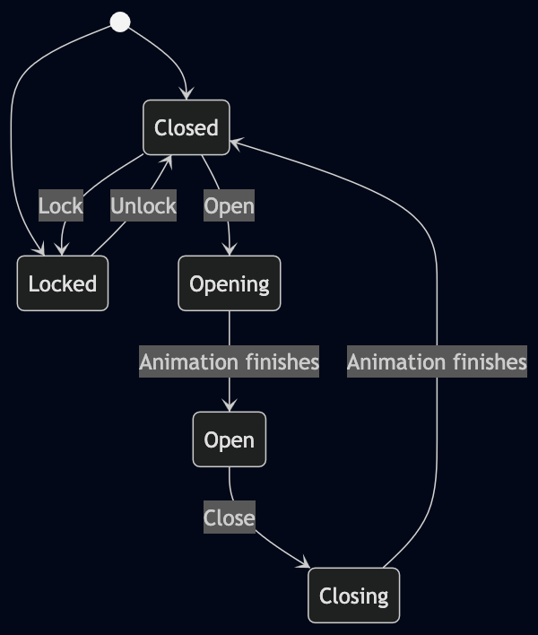

# Understanding Finite State Machines in React

One of my favorite design patterns is called Finite State Machine. I often think this pattern is overlooked, specially in React. I sometimes code review pull requests where I see a bunch of `if`s nested and comparing booleans and fighting against weird states or even having to use timers to compensate for some processing time.

Let me preach about the Finite State Machine.

## First example

This is how I learned about this pattern: I was building a Facebook game in Flash —remember those days?— I was working on a door. It was a 2.5D view where you walked down a hall and you used the mouse to click a door to get into the room. The behavior we were expecting when hovering the door was that it should open and it should close if the mouse went outside the door. The door was also capable of being locked or not, so no opening should be done on hover.

You can see that my first approach was a noodle soup of nested `if`s. There was also this awful glitch where the door would jump from half way open to fully open and closing. It was a mess.

I remember I was reading something completely unrelated when I came across the design pattern. Something clicked. "Of course! That's what I'm trying to build without knowing". I took pen and paper and started jotting down:

- The door can start being open or locked
- If it's locked, it can only be unlocked.
- If closed, it can be locked or opened.
- Between open and closed, we have animations. Wait for them to be completed.

Then this started to look more like a diagram. I ended up with something like this:

Well, my friend, that's a state diagram. That's the first step towards creating a state machine.

## So... what's a Finite State Machine anyway?

It's a model where you have a "something" that can be in one **state** at a time. This "something" can **transition** between states as a result of an **input**.

In our example, the door can be in many states and only by acting on it you can change its state and it behaves differently on each state.

## Let's implement this door in React.

