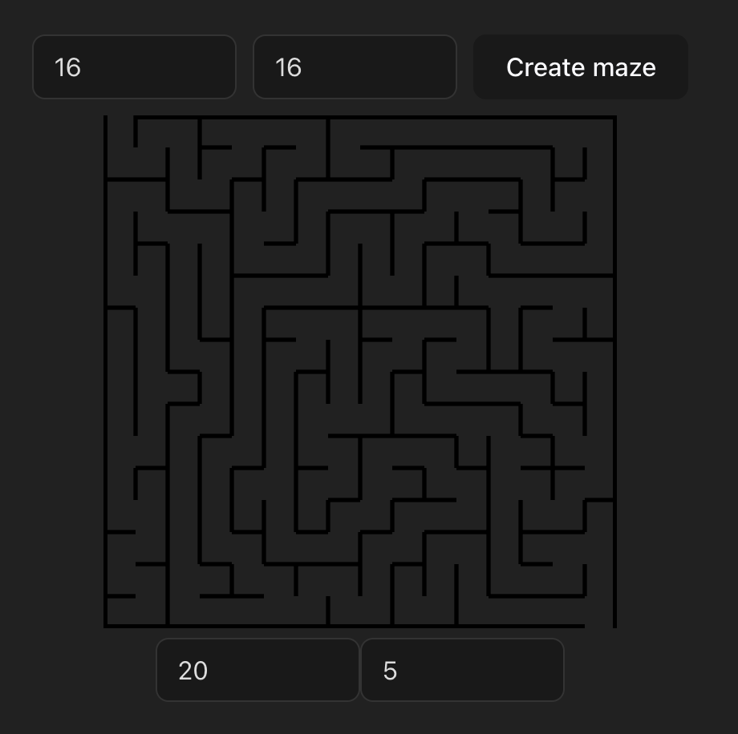
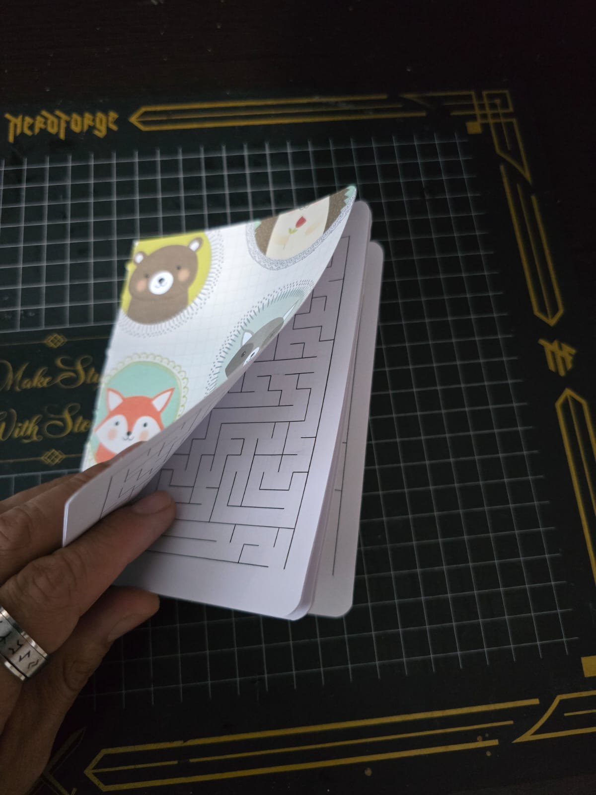

# Maze builder in Typescript and React

Today I had breakfast with my family in a nearby restaurant. As soon as we sat down, the waiter brought one of those paper coloring tablecloths for my kid. As he was making his way through narrow corridors with his green crayon, my mind was drifting away thinking about how awesome would be to have an infinite supply of mazes for him.

Note to self: create a maze builder and mass produce mazes for my kid.

## Defining the specs

I want a "thing" that will output mazes for me to print. My first thought is to make it configurable so I can print any size. I will prototype this with 1/4 letter mazes so I can print a couple of them in a single page and make them easy to carry around. 

Now, the "thing"... what should it be? It can be a CLI tool or a web app. Maybe a web app makes sense so I can publish it and make it available for other kid tamers as myself.

I want to center this around printing the output, so instead of generating the image on a canvas, I think it would be better to output an svg file to keep the borders crisp.

crisp.

## The memory definition

A maze is a group of corridors. Those corridors have walls or not on each face. A corridor with all the walls is an enclosed room.

Let's have cells representing these corridors in a 2D grid. Each cell should store the state of its walls. We can store this numerically using bit wise operations:

```
Walls  Up     Right  Down   Left
       8      4      2      1

Bits   0      0      0      0      =  0
Cell
       · · ·
       · · ·
       · · ·

Bits   1      0      1      0      = 10
Cell
       ═ ═ ═
       · · ·
       ═ ═ ═

Bits   1      1      1      1      = 15
Cell
       ╔ ═ ╗
       ║ · ║
       ╚ = ╝
```

This allows us to represent the whole maze in a `number[][]`.

I will abstract this into a Maze object so we can query the data in a more idiomatic way.

```ts
export type Direction = "U" | "R" | "D" | "L";

const dirMap = { U: 8, R: 4, D: 2, L: 1 };

export class Maze {
  width: number;
  height: number;
  grid: number[][];

  constructor(width: number, height: number) {
    this.width = width;
    this.height = height;
    this.grid = Array.from({ length: height }, () => Array(width).fill(0b1111)); // Initialize everything with 4 walls
    this.setWall(0, 0, "U", false); // Except the top left's upper wall
    this.setWall(width - 1, height - 1, "D", false); // and the bottom right's bottom wall
  }

  setWall(x: number, y: number, direction: Direction, hasWall: boolean) {
    if (hasWall) {
      this.grid[y][x] |= dirMap[direction];
    } else {
      this.grid[y][x] &= ~dirMap[direction];
    }
  }

  hasWall(x: number, y: number, direction: Direction): boolean {
    return (this.grid[y][x] & dirMap[direction]) !== 0;
  }
}
```

## A visual representation

Drawing this is easy. We just have to walk the matrix and draw an offset line depending on the wall direction and the state:

```tsx
import type { ReactElement } from "react";
import type { Maze } from "./Maze";

export function MazeCanvas({
  maze,
  cellSize = 20,
  wallWidth = 2,
}: {
  maze: Maze;
  cellSize?: number;
  wallWidth?: number;
}): ReactElement {
  const lines: ReactElement[] = [];
  for (let y = 0; y < maze.height; y++) {
    for (let x = 0; x < maze.width; x++) {
      // Top left corners of the cell
      const px = x * cellSize;
      const py = y * cellSize;

      // If we have an up wall
      if (maze.hasWall(x, y, "U")) {
        // Add the top horizontal line to the render list
        lines.push(
          <line
            key={`U-${x}-${y}`}
            x1={px}
            y1={py}
            x2={px + cellSize}
            y2={py}
            stroke="black"
            strokeWidth={wallWidth / 2}
          />
        );
      }
      // If we have a right wall
      if (maze.hasWall(x, y, "R")) {
        // Add the right vertical line to the render list
        lines.push(
          <line
            key={`R-${x}-${y}`}
            x1={px + cellSize}
            y1={py}
            x2={px + cellSize}
            y2={py + cellSize}
            stroke="black"
            strokeWidth={wallWidth / 2}
          />
        );
      }
      // Same with the down wall
      if (maze.hasWall(x, y, "D")) {
        lines.push(
          <line
            key={`D-${x}-${y}`}
            x1={px + cellSize}
            y1={py + cellSize}
            x2={px}
            y2={py + cellSize}
            stroke="black"
            strokeWidth={wallWidth / 2}
          />
        );
      }
      // ... and the left wall
      if (maze.hasWall(x, y, "L")) {
        lines.push(
          <line
            key={`L-${x}-${y}`}
            x1={px}
            y1={py + cellSize}
            x2={px}
            y2={py}
            stroke="black"
            strokeWidth={wallWidth / 2}
          />
        );
      }
    }
  }

  return (
    <svg width={maze.width * cellSize} height={maze.height * cellSize}>
      {/* Draw the borders of the maze. Notice the top left cell always opens at the top and the bottom right cell always opens at the bottom. */}
      <line
        x1={0 + cellSize}
        y1={0}
        x2={maze.width * cellSize}
        y2={0}
        stroke="black"
        strokeWidth={wallWidth}
      />
      <line
        x1={0}
        y1={maze.height * cellSize}
        x2={maze.width * cellSize - cellSize}
        y2={maze.height * cellSize}
        stroke="black"
        strokeWidth={wallWidth}
      />
      <line
        x1={0}
        y1={0}
        x2={0}
        y2={maze.height * cellSize}
        stroke="black"
        strokeWidth={wallWidth}
      />
      <line
        x1={maze.width * cellSize}
        y1={0}
        x2={maze.width * cellSize}
        y2={maze.height * cellSize}
        stroke="black"
        strokeWidth={wallWidth}
      />
      {lines}
    </svg>
  );
}

```

Note the line width. I'm using half the stroke width for the internal walls for aesthetic purposes.

## Carving the maze

The meat of this article, right? We have a way of representing the maze and now a way to print it, but right now we only have a matriz of enclosed rooms.

The algorithm I'm going to use is [randomized depth-first search](https://en.wikipedia.org/wiki/Maze_generation_algorithm#Randomized_depth-first_search) with stack. I think this algorithm is easy enough for what I want to do, and it still generates pretty nice mazes.

The way it works is like this:
- We keep a stack of cells and the list of visited cells.
- We select a starting cell, push it to the stack and mark it as visited.
- While the stack is not empty:
	- We choose randomly a valid unvisited neighbor of the top of the stack.
	- If there are valid neighbors:
		- We mark it as visited and remove the walls between the previous cell and the new one.
		- We then push it to the stack.
	- else:
		- We pop a cell from the stack

We basically run randomly breaking walls until we crash into ourselves, so we step back until a new path is possible to run rampant again.

This is my implementation:

```ts
import { Maze, type Direction } from "./Maze";

export function randomizedDepthFirstMaze(width: number, height: number): Maze {
  const maze = new Maze(width, height);
  const stack: [number, number][] = [];
  const visited: boolean[][] = Array.from({ length: height }, () =>
    Array(width).fill(false)
  );

  // This map helps us find valid neighbors
  const directions: [number, number, Direction][] = [
    [0, -1, "U"],
    [1, 0, "R"],
    [0, 1, "D"],
    [-1, 0, "L"],
  ];

  // This function returns the opposite direction so we can break the wall from both cells
  function getOppositeDirection(dir: Direction): Direction {
    const opposites: Record<Direction, Direction> = {
      U: "D",
      D: "U",
      L: "R",
      R: "L",
    };
    return opposites[dir];
  }

  stack.push([0, 0]);
  visited[0][0] = true;

  while (stack.length > 0) {
    const [x, y] = stack[stack.length - 1];
    const neighbors: [number, number, Direction][] = [];

    // Check the neighbors directions
    for (const [dx, dy, dir] of directions) {
      const nx = x + dx;
      const ny = y + dy;
      // If it's valid and not visited, add it to the list
      if (nx >= 0 && nx < width && ny >= 0 && ny < height && !visited[ny][nx]) {
        neighbors.push([nx, ny, dir]);
      }
    }

    // If we have neighbors
    if (neighbors.length > 0) {
      const [nx, ny, dir] =
        neighbors[Math.floor(Math.random() * neighbors.length)]; // Choose randomly

      visited[ny][nx] = true; // Mark as visited

      // Remove walls between current cell and neighbor
      maze.setWall(x, y, dir, false);
      const oppositeDir = getOppositeDirection(dir);
      maze.setWall(nx, ny, oppositeDir, false);

      stack.push([nx, ny]);
    } else {
      // No valid neighbors, go back by popping the stack
      stack.pop();
    }
  }

  return maze;
}
```

The rest is an implementation detail. I'm just going to add some controls to configure the maze and a button to generate new ones.

```tsx
import { useState } from "react";

import { Maze } from "./Maze";
import { randomizedDepthFirstMaze } from "./MazeBuilder";
import { MazeCanvas } from "./MazeCanvas";

export function App() {
  const [width, setWidth] = useState(16);
  const [height, setHeight] = useState(16);
  const [cellSize, setCellSize] = useState(50);
  const [wallWidth, setWallWidth] = useState(2);
  const [maze, setMaze] = useState<Maze>(new Maze(1, 1));
  function hndCreate() {
    setMaze(randomizedDepthFirstMaze(width, height));
  }
  function hndFocus(e: React.FocusEvent<HTMLInputElement>) {
    e.target.select();
  }
  return (
    <div>
      <div style={{ marginBottom: "10px", display: "flex", gap: "10px" }}>
        <input
          type="text"
          placeholder="Width"
          style={{ width: "100px" }}
          value={width}
          onChange={(e) => setWidth(Number(e.target.value))}
          onFocus={hndFocus}
        />
        <input
          type="text"
          placeholder="Height"
          style={{ width: "100px" }}
          value={height}
          onChange={(e) => setHeight(Number(e.target.value))}
          onFocus={hndFocus}
        />
        <button onClick={hndCreate}>Create maze</button>
      </div>
      <MazeCanvas maze={maze} cellSize={cellSize} wallWidth={wallWidth} />
      <div>
        <input
          type="text"
          placeholder="cell size"
          style={{ width: "100px" }}
          value={cellSize}
          onChange={(e) => setCellSize(Number(e.target.value))}
          onFocus={hndFocus}
        />
        <input
          type="text"
          placeholder="wall width"
          style={{ width: "100px" }}
          value={wallWidth}
          onChange={(e) => setWallWidth(Number(e.target.value))}
          onFocus={hndFocus}
        />
      </div>
    </div>
  );
}
```

And with this, we have our maze builder:



Now, with a couple of extra work, you can add some print css and layout the mazes to be printed and bound. You can add a nice paper for the cover and there you go. An infinite amount of mazes you can take with a non wax crayons (unless you want a big red sludge on your car seat) to keep your kid entertained for —let's be honest— like 5 minutes.



## Conclusion

Programmatically making mazes is not too hard once you know the trick. Making your kid sit down and let you talk with your wife for more than 5 minutes in a restaurant... that's hard, man.