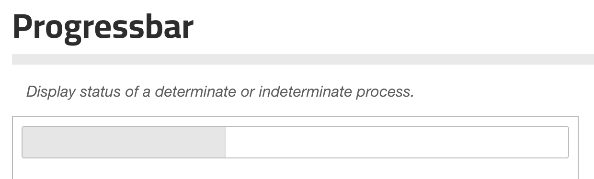
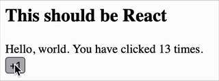
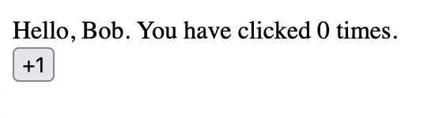
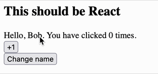
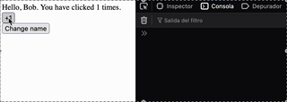
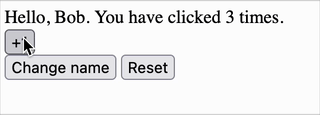

# Mixing jQuery UI with React

When React was the new kid on the block, many of us were still writing $ all over the place. Mutating the DOM was an obvious answer for everything and the callback hell was inevitable.

In this context I was assigned to a project made in Drupal 7 with jQuery UI widgets sprinkled here and there. One of the leads at the time came up with the idea of trying React for a specific view. This is how I learned React: pushing a cube into a circle shaped hole.

# The setup

The Drupal instalation had a custom theme where we were showing a couple of tabs. These tabs were where the data was supposed to show. This was built with jQuery UI. The data was fetched using `$.ajax` calling an endpoint in Drupal.

I discovered a data-* attribute that allowed me to regain full control over a div. That became my React mounting point.

And you can still do that. Whenever you have an isolated and untouched DOM element, you can make it a React root and mount anything there. That's how we delivered, but that wouldn't make a good story, right? There's no drama. No neat tricks... except...

## Enter jQuery UI widgets

Years ago, for a Developer's Meet Up in my home town I wanted to talk about something funky, so I took a stab at a weird idea I was never able to test in the old Drupal project.

The magic behind jQuery UI is what they call "widgets". It's a way to encapsulate events, methods, templates, etc. in a jQuery-ish way. You can use it like this:

```js
$("#progressbar").progressbar({
  value: 37
});
```

And you'd magically transform your div with id `#progressbar` into a progress bar.



Usually you would use the widgets that came out of the box, maybe you would pull in a contrib widget or two from trusted sources —before npm and bloated node_modules—, but there's a lesser known feature of jQuery UI that allows you to create your own widgets. It's called the [widget factory](https://api.jqueryui.com/jQuery.widget/).

I used this a couple of times when I worked on the old stack I mentioned before and the way it encapsulated things reminded me later on of react components.

You see, when you create a new widget, you pass to the factory a couple of things. First, you specify the API inputs in the form of "options". This was how you could tell your progress bar widget the max value, for example. Sound familiar? —ahem... props?— You can also specify "events" that could be listened to. Let's say you want to run a callback whenever your progress bar reaches 100% —cough cough... callback props?— Lastly, you could specify methods to imperatively command things to the widget. Like setting the value of your progress bar —like, let's say, useImperativeHandle?—

Indeed, I created a PoC mapping these concepts. 

Thinking about this visually, it's a 1:1 relationship.

```
  ________________________________________
  | widget       | React component       |
  |______________|_______________________|
  | options ---- | --> props             |
  | events  <--- | --  callback props    |
  | methods ---- | --> imperative handle |
  ----------------------------------------

```

## Let's test the concept

### Rendering React inside a jQuery UI widget

I created a hello world component in React that receives a prop `name` and keeps a counter:

```jsx
export function MyComponent({ name }) {
  const [count, setCount] = useState(0);
  const hndClick = () => {
    setCount((count) => count + 1);
  }
  return (
    <div>
      <div>Hello, { name }. You have clicked {count} times.</div>
      <div>
        <button onClick={hndClick}>+1</button>
      </div>
    </div>
  );
}
```

Now let's assume we have a global $ from jQuery and jQuery UI. Let's use the Widget factory to wrap this sample component. The magic happens on the `_create` method. It is called when the widget gets instantiated.

```js
$.widget("myapp.mywidget", {
  options: {
    name: "world", // <- We can set a default value here or at the component level
  },
  _create: function () {
    this._root = createRoot(this.element.get(0)) // <- On create we create the React root and we use this.element's first HTML Element
    this._root.render(createElement(MyComponent, { name: this.options.name })) // <- We render MyComponent in the root. We pass the options as props
  }
  });

  // When the document is ready...
  $(document).ready(function () {
    $("#main").mywidget(); // We create an instance of our widget in a div with id #main
});
```



And you can pass down options to configure these initial props:

```js
$("#main").mywidget({
  name: "Bob"
});
```



### From Options to Props

This is nice, but what happens if we want to update the options on the fly?

For us, React developers, rendering a component manually is not common. We usually set it up once and everything is Reactland. We often forget that the root can be rendered... **and updated!**

We can hook into a method called `_setOptons`, this is called whenever you update an option programmatically, and from here, we tell React to update itself.

```js
$.widget("myapp.mywidget", {
  options: {
    name: "world",
  },
  // We move our render logic to a private method
  _render() {
    this._root.render(createElement(MyComponent, { name: this.options.name }))
  },
  _create: function () {
    this._root = createRoot(this.element.get(0))
    this._render(); // <- We call render here
  },
  // And we intercept the options setter
  _setOptions: function(options) {
    this._super(options); // <- we keep the original behavior
    this._render(); // <- and call rerender again here
  },
});
```

Now, I created a button and hooked up a listener to update the option programmatically "the old way":

```js
$("#btn").on("click", function () {
  $("#main").mywidget("option", "name", "Alice");
});
```

Voilá!



### Triggering Events

How about triggering events. Let's trigger one every time the user hits a multiple of 3.

The first step is making this happen on the React component. Let's use a callback prop here.

```jsx
export function MyComponent({ name, onMultipleOfThree }) {
  const [count, setCount] = useState(0);
  const hndClick = () => {
    setCount((count) => count + 1);
    // Check for multiples of three. Remember count is still n - 1
    if ((count + 1) % 3 === 0) {
      onMultipleOfThree(count + 1);
    }
  }
  return (
    <div>
      <div>Hello, { name }. You have clicked {count} times.</div>
      <div>
        <button onClick={hndClick}>+1</button>
      </div>
    </div>
  );
}
```

And we hook it to the jQuery event system in the widget. Let's add an arrow function as the prop and inside the function, we call the `_trigger` method with an event name. This is the jQuery UI way of emitting events.

```js
_render() {
  this._root.render(
    createElement(
      MyComponent,
      {
        name: this.options.name,
        onMultipleOfThree: (num) => {
          this._trigger("multipleofthree", null, { num }); // <- event name, then a null to tell the system to use the default context, then we pass down any arbitrary value we want.
        }
      }
    )
  );
}
```

Let's test this code by listening to the event we just created and bound.

```js
$("#main").mywidget({
  name: "Bob"
}).on('mywidgetmultipleofthree', (self, { num }) => { // <- Notice the name of the event is prefixed by the widget name!
  console.log('> Multiple of three found! %s', num)
});
```



### Commanding the widget

Let's try one last thing. On jQuery UI, you can call public methods on each widget. This is similar to what we do with refs in React when, for example, we manually trigger the focus on an input.

Let's say we want a reset button that can be triggered from outside. Let's add an imperative handle to our component.

First, we receive a new `ref` prop. We need this for our `useImperativeHandle` hook:

```jsx
export function MyComponent({ name, onMultipleOfThree, ref }) { // <- Ref
  // ...
  useImperativeHandle(ref, () => ({ // <- We use it here
    reset: () => { // <- We define our public API
      setCount(0);
    }
  }));
  // ...
}
```

Next, we have to tweak our render method in jQuery UI to pass down the ref. The way we do this is by passing a function. This function will have an argument containing the reference to the public API of our React component:

```js
$.widget("myapp.mywidget", {
  // ...
  _render() {
    this._root.render(
      createElement(
        MyComponent,
        {
          // ...
          ref: (ref) => {
            this._ref = ref; // <- This is our handle, so we set it in a private property
          },
          // ...
        }
      )
    );
  },
  // ...
);
```

Now, we just have to create a new public method on our widget and call the public API of our React component:

```js
$.widget("myapp.mywidget", {
  // ...
  reset() {
    this._ref.reset(); // <- this is the bridge
  }
  // ...
});
```

I just added a new button and this is how the listener looks like:

```js
$("#reset").on("click", function () {
  $("#main").mywidget("reset"); // This calls the public method of our widget
});
```

Done!



This is the whole component:

```jsx
import { createElement, useImperativeHandle, useState } from "react";
import { createRoot } from "react-dom/client";

export function MyComponent({ name, onMultipleOfThree, ref }) {
  const [count, setCount] = useState(0);
  useImperativeHandle(ref, () => ({
    reset: () => {
      setCount(0);
    },
  }));
  const hndClick = () => {
    setCount((count) => count + 1);
    if ((count + 1) % 3 === 0) {
      onMultipleOfThree(count + 1);
    }
  };

  return (
    <div>
      <div>
        Hello, {name}. You have clicked {count} times.
      </div>
      <div>
        <button onClick={hndClick}>+1</button>
      </div>
    </div>
  );
}

$.widget("myapp.mywidget", {
  options: {
    name: "world",
  },
  _create: function () {
    this._root = createRoot(this.element.get(0));
    this._render();
  },
  _setOptions: function (options) {
    this._super(options);
    this._render();
  },
  _render() {
    this._root.render(
      createElement(MyComponent, {
        ref: (ref) => {
          this._ref = ref;
        },
        name: this.options.name,
        onMultipleOfThree: (num) => {
          this._trigger("multipleofthree", null, { num });
        },
      })
    );
  },
  reset() {
    this._ref.reset();
  },
});

```

## Widgetizer

If we were to create multiple widgets, we would have a lot of repeated scaffolding code. And at worst, we would have very ad hoc bridges, each one with different methods. We can definitely automate that. This is how **Widgetizer** was born.

The concept was this: you build a React component and you could plug it into a magic function and the result was a jQuery UI widget that you could invoke on whatever div you wanted... and interface it!

Considering the React component we already have, this is how I envisioned the client consuming the API to achieve the exact same thing.

```js
// widgetize(component, widgetName, mapOptionsToProps, mapEventsToProps, mapMethodsToImperativeHandle);

widgetize(
  // Component
  MyComponent,
  // widget name
  "myapp.mywidget",
  // Default options
  {
    name: "World",
  },
  // Mapping events to props
  (trigger) => ({
    onMultipleOfThree: (num) => {
      trigger("multipleofthree", { num })
    }
  }),
  // Mapping methods to imperative handles
  {
    reset: (ref) => {
      ref.reset();
    }
  }
);
```

And finally! This is the magic `widgetize` function.

```js
export function widgetize(Component, name, mapOptionsToProps, mapEventsToProps, mapMethodsToImperativeHandle) {
  return $.widget(name, {

    options: { ...mapOptionsToProps },

    _create: function() {
    this.root = createRoot(this.element.get(0));
    this._render();
    },

    _setOptions: function(options) {
    this._super(options);
    this._render();
    },

    _render: function() {
    this.root.render(createElement(Component, {
    ...this.options,
    ...this._getEvents(),
    ref: (ref) => this._ref = ref,
    }))
    },

    _getEvents: function() {
    return mapEventsToProps((event, data) => this._trigger(event, null, data));
    },

    ...(Object.keys(mapMethodsToImperativeHandle).reduce((acc, method) => ({
      ...acc,
      [method]: function(...args) {
        return mapMethodsToImperativeHandle[method](this._ref, ...args);
      }
    }), {})),
  });
}
```

Nice, eh.

## Conclusion

You can mix jQuery and React in a very elegant way instead of just botching the solution. You just have to be conscious about the very different design philosophies and create translations.

I hope these posts about weird ways of mixing React with funky stuff had motivated you to try out new things just for the sake of it.

## Demo repo

I kind of modernized the demo I did for the Meet Up, but please be aware it's just a quick PoC just for this post. It's not tested in battle.

Here you go. Use at your own risk:

The modernized demo branch: https://github.com/alexyshegmann/widgetizer-poc/tree/modernization

The old (7 years ago in 2025) demo branch: https://github.com/alexyshegmann/widgetizer-poc/tree/part4