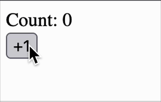
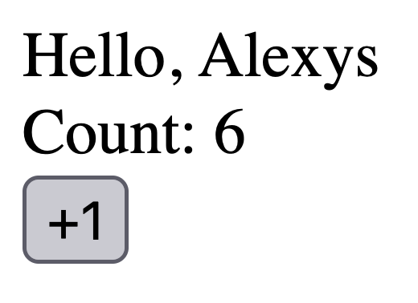

# React mixology: mixing React with other frameworks

Usually, whenever you start a new project, you define your stack and work your way up. But imagine this: you have an inherited project in a very different framework, but you have to revamp it and build new features around it. You want to modernize the stack a little bit. The team agrees to go with React and slowly refactor old parts with the Strangle approach __whenever you have time™️__.

## The old stack: Angular

I created a new angular app using the CLI for this post, but let's keep imagining that this is a prod app already serving clients. In this hypothetic scenario, you start with a new feature that requires a new route. Let's just create a new component that will serve as a container.

```shell
$ ng generate component my-react-page
```

```ts
// src/app/my-react-page/my-react-page.ts
import { Component } from '@angular/core';

@Component({
	selector: 'app-my-react-page',
	imports: [],
	templateUrl: './my-react-page.html',
	styleUrl: './my-react-page.css'
})
export class MyReactPage {}
```

Then we put it in a route in the router.

```ts
// src/app/app.routes.ts

export const routes: Routes = [
  // ... more routes
  {
    path: 'react',
    component: MyReactPage,
  }
// ... more routes
];
```

Right, you have an Angular component rendering text in a route. Where do we go from here?

The most important thing when mixing libraries is **boundaries**. You have to be very careful about who owns what. In this case, the component we just created will be our middleman.

## Let's bring in React

Ok, now that you have the Angular part set up, let's install React.

```shell
$ npm install react react-dom
$ npm install --save-dev @types/react @types/react-dom
```

Now, let's tell Typescript that we are also using react. In your `tsconfig.json` file, look for `compilerOptions` and add the following config:

```json
// tsconfig.json
{
  // ...
  "compilerOptions": {
    // ...
    "jsx": "react",
    // ...
  },
  // ...
}
```

Now, let's create a new react component. I'm going to put it inside a `components` directory. Remember using the .tsx extension and importing React.

```tsx
// src/app/my-react-page/components/MyReactComponent.tsx
import React, { useState } from "react";

export function MyReactComponent() {
	const [count, setCount] = useState(0);
	return (
		<div>
			<div>Count: {count}</div>
			<button onClick={() => setCount(count + 1)}>+1</button>
		</div>
	)
}
```

The next step is binding the two together:

This will be the secret sauce. Let's use Angular to get a reference to an empty div. We will give it to our React component.

## The middleman

Since we won't need a full blown html template, I'll replace `templateUrl` with `template` and just add a div there.

```ts
// src/app/my-react-page/my-react-page.ts

template: `<div #myreactpage></div>`,
```

Notice the `#myreactpage`. This will allow us get the reference with `ViewChild`. Let's also create a private variable to store the React root:

```ts
// src/app/my-react-page/my-react-page.ts

import { Component, ElementRef, ViewChild } from '@angular/core';
import { Root } from 'react-dom/client';

@Component({
  selector: 'app-my-react-page',
  imports: [],
  template: `<div #myreactpage></div>`,
  styleUrl: './my-react-page.css'
})
export class MyReactPage {
  @ViewChild("myreactpage", { static: false }) _wrapper?: ElementRef<HTMLDivElement>
  private _root?: Root
}
```

With this, we now can use `ngAfterViewInit` hook to create the React root:

```ts
// src/app/my-react-page/my-react-page.ts

ngAfterViewInit() {
  if (this._wrapper) {
    this._root = createRoot(this._wrapper.nativeElement)
  }
}
```

The last step is to render the component in the root. I will create a new function to do this and call it in `ngAfterViewInit`:

```ts
// src/app/my-react-page/my-react-page.ts

ngAfterViewInit() {
  if (this._wrapper) {
    this._root = createRoot(this._wrapper.nativeElement)
    this.render()
  }
}

render() {
  this._root?.render(createElement(MyReactComponent))
}
```

Notice I'm using React's `createElement` function instead of writing the jsx version. This is just stylistic since I want to keep a separation between Angular and React, so I didn't want to bring jsx into the Angular component.

If you run this, you'll find a nice React component playing alongside Angular.



## Passing down props

You can pass down props, so you can reference services and whatnot. Let's pass down a router param to our React component.

First, let's change the component to accept a prop:

```tsx
// src/app/my-react-page/components/MyReactComponent.tsx

import React, { useState } from "react";

// Define our props
interface MyReactComponentProps {
  name: string | null;
}

export function MyReactComponent({ name }: MyReactComponentProps) {
  const [count, setCount] = useState(0);
  return (
    <div>
      <div>Hello, {name}</div> {/* Let's just say hi */}
      <div>Count: {count}</div>
      <button onClick={() => setCount(count + 1)}>+1</button>
    </div>
  );
}
```

Now, let's pull the data from the router and pass it to our React component.

```ts
// src/app/my-react-page/my-react-page.ts

import { Component, ElementRef, ViewChild } from '@angular/core';
import { createElement } from 'react';
import { createRoot, Root } from 'react-dom/client';
import { MyReactComponent } from './components/MyReactComponent';
import { ActivatedRoute } from '@angular/router';

@Component({
  selector: 'app-my-react-page',
  imports: [],
  template: `<div #myreactpage></div>`,
  styleUrl: './my-react-page.css'
})
export class MyReactPage {
  @ViewChild("myreactpage", { static: false }) _wrapper?: ElementRef<HTMLDivElement>

  // New private property to store the name
  private _name: string | null = null
  private _root?: Root

  // This gives us access to the route
  constructor(private route: ActivatedRoute) {}

  // And we initialize the property on init
  ngOnInit(): void {
    this._name = this.route.snapshot.paramMap.get('name') // <- ":name"
  }

  ngAfterViewInit() {
    if (this._wrapper) {
      this._root = createRoot(this._wrapper.nativeElement)
      this.render()
    }
  }

  render() {
    this._root?.render(createElement(MyReactComponent, { name: this._name })) // <- We pass down our _name property to our `name` prop
  }
}
```

Finally, we set the router to accept a param:

```ts
// src/app/app.routes.ts

export const routes: Routes = [
  // ...
  {
    path: 'react/:name', // <- And we add the param to the route
    component: MyReactPage,
  }
];
```

Blam! The param has traveled down to the React component with its own state.



## Caveats

### Providers

When working on a React SPA, one of the most common patterns is having a list of providers at the top of the App to serve the entire application. This is not the case in this approach. Each Angular component have a different render tree and a different root. Sharing state between components is not straight forward.

This is how I would work around the issue: Create a vanilla store and enforce it to be a singleton. Use `useSyncExternalStore` to listen to the changes and rerender accordingly.

In the case of tanstack query, you can share the query client by instantiating it only once and passing only one to all the providers on each render tree.

### Routing

You already have a router with Angular, so you could have two routers fighting over the same resource: your navigation history.

One potential workaround is using a hash router or a memory router for your internal routes and once you have strangled the old app enough, switch the router type.

## Conclusion

With this mental experiment, it is possible to implement both Angular and React, but it's not easy. Specially since Angular is very opinionated.

If you **have** to do this, be mindful about the special mindset each library requires. Try not to force concepts from one realm to the other: be a translator.