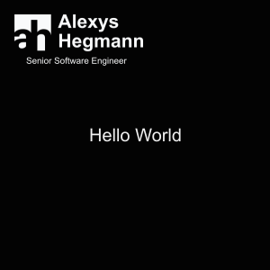
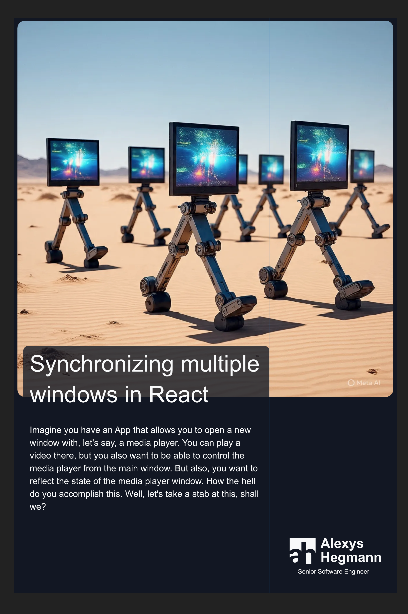
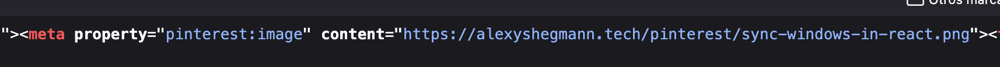

# Creating thumbnails automagically with node-canvas

I wanted to start sharing this content in other places, but I don't want to spend time creating thumbnails —live is short enough. I thought: what if I create a step in the build process to automatically create them... with Javascript!

# Introducing node-canvas

In my research I came across this node package that ports the Canvas API for image generation. I'm super familiar with the Canvas API for the browser since I like creating games for the browser and Canvas' 2D Context is usually my weapon of choice when it comes to displaying stuff.

You can just installing with `npm install canvas` and start using it.

# How to use it

I fell in love with this image. It's as easy as working with the browser's canvas, but instead of querying the canvas element from the DOM, you create it with `createCanvas(width, height)`. This gives you an instance of a Canvas from where you can get the Context2D object via `getContext("2d")`.

Once you have the context, just draw!

# A quick hello world

Let's create a quick hello world so you feel the vibes of this package.

```js
// hello.mjs
import { createCanvas, loadImage } from "canvas";
import fs from "fs";

// Create canvas
const canvas = createCanvas(300, 300);
const ctx = canvas.getContext("2d");

// Draw the background
ctx.fillStyle = "#030303";
ctx.fillRect(0, 0, canvas.width, canvas.height);

// Write "hello world"
ctx.fillStyle = "#f1f1f1";
ctx.font = "20px Arial";
ctx.textBaseline = "middle";
ctx.textAlign = "center";
ctx.fillText("Hello World", 150, 150);

// Load and draw an image
const logo = await loadImage("./bloglogo.svg");
ctx.drawImage(logo, 16, 16, 143, 57);

// Save the canvas as a PNG
canvas.createPNGStream().pipe(fs.createWriteStream("hello-world.png"));
```

Boom!



# Let's build my thumbnail

I had a pretty clear image of what I wanted to draw, so I opened Affinity Designer to lay out everything nicely. I used the inspector to get the dimensions of the blocks I wanted and started writing the steps.

This is what I wanted to build:



If you split everything by its parts, you'll see you have these elements:

* A solid background
* A feature image with rounded corners
* A semitransparent overlay
* A block of text
* A logo

Let's see how to accomplish this.

## The canvas

So let's create a new canvas with a nice size for a Pinterest image.

```js
const WIDTH = 1200;
const HEIGHT = 1800;
const canvas = createCanvas(WIDTH, HEIGHT);
const ctx = canvas.getContext("2d");
```

## The background

As shown in the hello world, the background is a solid rect with a defined color, so let's do the same thing, but with the color we want:

```js
const WIDTH = 1200;
const HEIGHT = 1800;
const DARK_BLUE = "#101828";

ctx.fillStyle = DARK_BLUE;
ctx.fillRect(0, 0, WIDTH, HEIGHT);
```

## The featured image

The first step to draw an image is to load it with `loadImage`, then we use Context's `drawImage` method:

```js
import { loadImage } from "canvas";

const WIDTH = 1200;
const IMAGE_SIZE = WIDTH - 20; // 10px margin per side

// ...
const img = await loadImage(imagePath);
// let's use a square image
ctx.drawImage(img, 10, 10, IMAGE_SIZE, IMAGE_SIZE);
// ...
```

But wait, this only draws the image. We need rounded corners! Well, the way to accomplish this is by using a clipping mask. Let's create a utility function to create rects with rounded corners:

```js
function drawRoundedRectangle(ctx, x, y, width, height, radius) {
ctx.beginPath();
ctx.moveTo(x + radius, y);
ctx.lineTo(x + width - radius, y);
ctx.quadraticCurveTo(x + width, y, x + width, y + radius);
ctx.lineTo(x + width, y + height - radius);
ctx.quadraticCurveTo(x + width, y + height, x + width - radius, y + height);
ctx.lineTo(x + radius, y + height);
ctx.quadraticCurveTo(x, y + height, x, y + height - radius);
ctx.lineTo(x, y + radius);
ctx.quadraticCurveTo(x, y, x + radius, y);
ctx.closePath();
}
```

Now let's use it before drawing the image:

```js
import { loadImage } from "canvas";

const WIDTH = 1200;
const IMAGE_SIZE = WIDTH - 20; // 10px margin per side

// ...
const img = await loadImage(imagePath);
// We create the rounded rectangle path
drawRoundedRectangle(ctx, 10, 10, IMAGE_SIZE, IMAGE_SIZE, 16);
// Then we create the clipping mask
ctx.clip();
// And we draw the image
ctx.drawImage(img, 10, 10, IMAGE_SIZE, IMAGE_SIZE);
// ...
```

Awesome!

But let's take this opportunity to talk about something important when working with Canvas context: the state. The state is a group of values that the context uses to draw stuff. One of the main points of the state is the ability to save and restore it. Internally, it uses a stack to push and pop these values and this allows us to do a lot of things —note to self: write an article about that—. In our case, saving and restoring the state will help us compose the clipped images easily.

```js
import { loadImage } from "canvas";

const WIDTH = 1200;
const IMAGE_SIZE = WIDTH - 20; // 10px margin per side

// ...
const img = await loadImage(imagePath);
// We save the state
ctx.save();
// We create the rounded rectangle path
drawRoundedRectangle(ctx, 10, 10, IMAGE_SIZE, IMAGE_SIZE, 16);
// Then we create the clipping mask
ctx.clip();
// Then we draw the image
ctx.drawImage(img, 10, 10, IMAGE_SIZE, IMAGE_SIZE);
// And we restore the state
ctx.restore();

// ... draw stuff without the clipping mask
```

## The overlay

By now, I'm pretty sure you know how to create this overlay with rounded corners. You already have all the tools.

```js
const WIDTH = 1200;
const HEIGHT = 1800;

ctx.save();
// If you are interested in the values:
// - The x and y are kind of arbitrary taken from the design.
// - The width is meant to take 2 / 3 of the image, but considering a 32px margin
// - The height is related to the y value - 16px margin
drawRoundedRectangle(ctx, 32, 1024, (WIDTH - 64) / 3 * 2, HEIGHT - 1040, 16);
ctx.fillStyle = DARK_BLUE;
// Make it semitransparent
ctx.globalAlpha = 0.75;
ctx.fill();
ctx.restore();
```

## The text

Drawing text in a canvas is a bit funky. There are no build in methods to draw paragraphs. There's only a text width calculation method. But with this rudimentary tool, you can write a function that wraps your text when needed. We will need this since all our text is dynamic.

The idea is to keep track of the line we will draw and add word by word until the line doesn't fit. When that happens, we draw the line without the last word and reset the line with just the word.

```js
const LINE_HEIGHT = 1.5;

function wrapText(ctx, text, x, y, maxWidth, fontSize) {
	let lineCount = 0;
	const words = text.split(" ");
	let line = "";
	const lineHeight = fontSize * LINE_HEIGHT;
	for (let i = 0; i < words.length; i++) {
		const word = words[i];
		const testLine = line + word + " ";
		const metrics = ctx.measureText(testLine);
		const testWidth = metrics.width;
		if (testWidth > maxWidth && i > 0) {
			ctx.fillText(line, x, y);
			line = word + " ";
			y += lineHeight;
			lineCount++;
		} else {
			line = testLine;
		}
	}
	ctx.fillText(line, x, y);
	return lineCount + 1; // Return the number of lines drawn
}
```

Now let's use this function:

```js
const title = "Lorem ipsum dolor sit amet"

const WHITE = "#F9FAFB";

const FONT_SIZE_TITLE = 48;
const FONT_FAMILY = "sans-serif";

ctx.save();
ctx.textBaseline = "top";
ctx.fillStyle = WHITE;
ctx.font = `bold ${FONT_SIZE_TITLE}px ${FONT_FAMILY}`;
ctx.textAlign = "left";
// The position of the text box is taken from the design
wrapText(ctx, title, 50, 1054, 730, FONT_SIZE_TITLE);
ctx.restore();
```

You might be wondering why do we return the number of lines when drawing the paragraph. Well, how else can we calculate the starting position of the text body when the title can span multiple lines?

Let's store that and use it to calculate the body:

```js
const excerpt = "A short summary of the article, blah blah blah...";

const GRAY = "#d1d5dc";

const FONT_SIZE_TITLE = 48;
const FONT_SIZE_CONTENT = 32;
const FONT_FAMILY = "sans-serif";
const LINE_HEIGHT = 1.50;

// ...
const titleLines = wrapText(ctx, title, 50, 1054, 730, FONT_SIZE_TITLE);
// ...

ctx.save();
ctx.textBaseline = "top";
ctx.fillStyle = GRAY;
ctx.font = `normal ${FONT_SIZE_CONTENT}px ${FONT_FAMILY}`;
ctx.textAlign = "left";
// The y value is the amount of lines times the font size of the title times the line height. This gives us the title text box height. To this number, you add the title height + a 20px margin for the bottom.
wrapText(ctx, excerpt, 50, (titleLines * FONT_SIZE_TITLE * LINE_HEIGHT) + 1074, 730, FONT_SIZE_CONTENT);
ctx.restore();
```

Now, since the image has a defined height, if the excerpt exceeds the available space, I didn't want to have broken text, so I wanted to add a smooth gradient to give the impression that the text continues beyond the image edge. Let's do that.

```js
const WIDTH = 1200;
const HEIGHT = 1800;
const GRADIENT_HEIGHT = 350;

const DARK_BLUE = "#101828";
const TRANSPARENT_DARK_BLUE = "rgba(16, 24, 40, 0.20)";

ctx.save();
// We create a gradient with a semitransparent color
const gradient = ctx.createLinearGradient(0, HEIGHT - GRADIENT_HEIGHT, 0, HEIGHT);
gradient.addColorStop(0, TRANSPARENT_DARK_BLUE);
gradient.addColorStop(1, DARK_BLUE);
ctx.fillStyle = gradient;
// And we fill a rect spaning from the bottom of the image up to 350px
ctx.fillRect(0, HEIGHT - GRADIENT_HEIGHT, (WIDTH - 64) / 3 * 2 + 16, GRADIENT_HEIGHT);
ctx.restore();
```

Finally, we need to add the logo. Luckily for us, node-canvas allows us to load svg files as well:

```js
ctx.save();
const logo = await loadImage("./logo.svg");
// The position and size come from the design
ctx.drawImage(logo, 864, 1630, 286, 115);
ctx.restore();
```

And there we go. We just need to save the image:

```js
const buffer = canvas.toBuffer("image/png");
const outputPath = `./pinterestImages/myImage.png`;
await fs.writeFile(outputPath, buffer);
console.log("Image saved successfully!");
```

Voilá!


# Next steps

This script requires you to define the featured image path, the title, the excerpt and an output path, but this can be easily converted to a function and create images automatically. That's what I did. I used a glob and a Markdown parser to extract the data I wanted from all my blogposts and created an image per article. You can inspect this very web page and you will find a Pinterest image in the meta tags.

