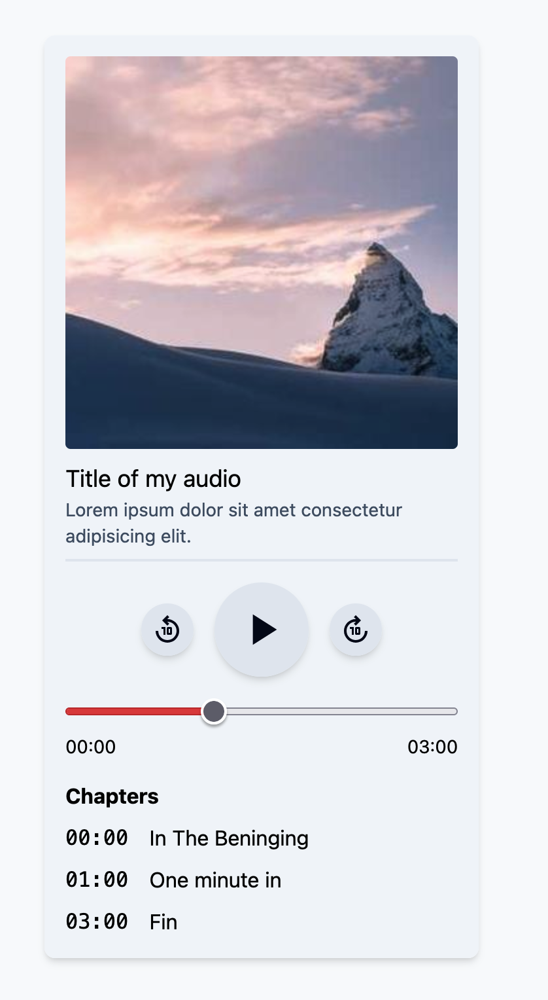
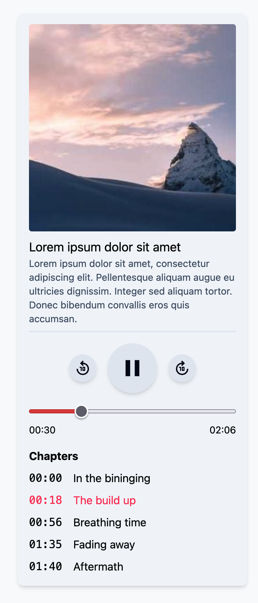

# Custom Audio Player in React

I'm currently working on a project that allows the user to upload and reproduce long-ish audio files. I wanted to keep a cohesive look and allow the uploaders to bookmark timestamps on their audios and let the listeners jump between these chapters. It was time for me to create a custom audio player!

## The engine: HTML's Audio API

There's a very robust API for handling audio in the browser called [Web Audio API](https://developer.mozilla.org/en-US/docs/Web/API/Web_Audio_API) , but since we are not doing some crazy stuff like effects or pipelines, we can base all our work on an HTMLAudioElement. This element can be referenced and controlled via JavaScript. We can also listen for events and react accordingly to the changes.

## How does the audio data will look like

First things first. Let's create a data structure to hold the audio metadata and the chapters and we can create a sample object. We will plug this in to make the metadata section of the component dynamic. This is also the shape of the data an API could return from the Backend.

```ts
// types/audio.ts
export interface MyAudio {
  title: string;
  description: string;
  source: string;
  image: string;
  chapters: Array<{
    name: string;
    timestamp: number;
  }>
}

// mockAudio.ts so we have some data to work with
export const mockAudio: MyAudio = {
  title: "Lorem ipsum dolor sit amet",
  description:
    "Lorem ipsum dolor sit amet, consectetur adipiscing elit. Pellentesque aliquam augue eu ultricies dignissim. Integer sed aliquam tortor. Donec bibendum convallis eros quis accumsan.",
  source: "/assets/epic-sigmaMusicArt-275522.mp3",
  image: "https://picsum.photos/seed/picsum/300/300",
  chapters: [
    {
      name: "In the bininging",
      timestamp: 0,
    },
    {
      name: "The build up",
      timestamp: 18,
    },
    {
      name: "Breathing time",
      timestamp: 56,
    },
    {
      name: "Fading away",
      timestamp: 95,
    },
    {
      name: "Aftermath",
      timestamp: 100,
    },
  ],
};

```

## Setting up the Component

I'm going to start with the design so we can get that out of the way and later on we can plug in the behavior.

I want a big fat play button with two smaller buttons that allow the user to go back or forward 10 seconds. I also want a time slider, some text to show the duration and the current time and some metadata.

I'm going to use TailwindCSS and Iconify to make my life easier. I'll also leave the time slider styling up to you.

```tsx
import { Icon } from "@iconify/react"

export function AudioPlayer() {
	return (
		<div className="bg-slate-100 p-4 rounded-lg shadow-md">
			<figure className="w-[300px] pb-2 mb-4 border-b-2 border-slate-200">
				
				<figcaption>
				  <h2 className="text-lg">{audio.title}</h2>
          <div className="text-sm text-slate-600">
            {audio.description}
          </div>
				</figcaption>
			</figure>
			<div className="flex flex-row gap-4 items-center justify-center">
				<button className="bg-slate-200 text-slate-950 hover:bg-slate-300 hover:text-rose-500 rounded-full p-2 shadow-md hover:shadow-none cursor-pointer">
					<Icon icon="material-symbols:replay-10" className="size-6" />
				</button>
				<button className="bg-slate-200 text-slate-950 hover:bg-slate-300 hover:text-rose-500 rounded-full p-4 shadow-md hover:shadow-none cursor-pointer">
					<Icon icon="material-symbols:play-arrow" className="size-10" />
				</button>
				<button className="bg-slate-200 text-slate-950 hover:bg-slate-300 hover:text-rose-500 rounded-full p-2 shadow-md hover:shadow-none cursor-pointer">
					<Icon icon="material-symbols:forward-10" className="size-6" />
				</button>
			</div>
			<div className="mt-4">
				<input type="range" className="w-full" />
			</div>
			<div className="text-sm flex flex-row justify-between mb-4">
        {/* This is a "magic" function that formats seconds into hh:mm:ss */}
				<div>{formatTime(position)}</div>
        <div>{formatTime(duration)}</div>
			</div>
			<div>
				<div className="font-bold mb-2">Chapters</div>
				<ul className="flex flex-col gap-2 [&>li>button]:flex [&>li>button]:gap-4 [&>li>button]:hover:text-rose-500 [&>li>button]:cursor-pointer">
					{audio.chapters.map((chapter, index) => (
            <li key={chapter.timestamp}>
              <button>
                <span className="font-mono">{formatTime(chapter.timestamp)}</span>
                <span>{chapter.name}</span>
              </button>
            </li>
          ))}
				</ul>
			</div>
		</div>
	);
}
```

And this is how the UI looks like:



## Let's make it functional

I was thinking we can use a hook to abstract this logic in case we need to create variants like a full screen version or a thin sticky version.

I envision this hook as a black box that receives a source audio and returns utilities to play it and get feedback about the reproduction.

Let's create a new Audio element in a ref and hook some listeners to some state:

```ts
import { useEffect, useRef, useState } from "react";

interface UseAudioPlayerProps {
  src: string;
}

export function useAudioPlayer({ src }: UseAudioPlayerProps) {
  // We hold our audio element here.
  const audio = useRef(new Audio());
  // Some state
  const [isReady, setIsReady] = useState(false);
  const [isPlaying, setIsPlaying] = useState(false);
  const [duration, setDuration] = useState(0);
  const [position, setPosition] = useState(0);

  // This runs when the file is ready
  const hndCanPlay = () => {
    setIsReady(true);
    setDuration(audio.current.duration);
  };

  // Playback controls
  const play = () => {
    audio.current.play();
  };
  const pause = () => {
    audio.current.pause();
  };

  const skipBack = () => {
    // Let's keep things over 0
    if (position - 10 <= 0) {
      audio.current.currentTime = 0;
      return;
    }
    audio.current.currentTime -= 10;
  };
  const skipForward = () => {
    // And guard the user from trying to go beyond the duration
    if (position + 10 >= duration) {
      audio.current.currentTime = duration;
      return;
    }
    audio.current.currentTime += 10;
  };

  // Reflect changes on the position and state
  const hndTimeUpdate = () => {
    setPosition(audio.current.currentTime);
  };
  const hndPlaying = () => {
    setIsPlaying(true);
  };
  const hndPause = () => {
    setIsPlaying(false);
  };

  // Handle src loading
  // TODO: Handle dynamic changes to the src prop?
  useEffect(() => {
    audio.current.src = src;
  }, [src]);

  useEffect(() => {
    // This will only load the metadata on initialization. Let's be mindful with the user's internet usage
    audio.current.preload = "metadata";
    // Hooking some listeners
    audio.current.addEventListener("canplay", hndCanPlay);
    audio.current.addEventListener("timeupdate", hndTimeUpdate);
    audio.current.addEventListener("playing", hndPlaying);
    audio.current.addEventListener("pause", hndPause);
    return () => {
      // Clean up the listeners like good boys
      audio.current.removeEventListener("canplay", hndCanPlay);
      audio.current.removeEventListener("timeupdate", hndTimeUpdate);
      audio.current.removeEventListener("playing", hndPlaying);
      audio.current.removeEventListener("pause", hndPause);
    };
  }, []);

  // The hook's API
  return {
    isReady,
    isPlaying,
    duration,
    position,
    play,
    pause,
    skipBack,
    skipForward,
  };
}
```

Now let's hook the functions and state to our component!

```tsx
export function AudioPlayer() {
  const {
    isReady,
    isPlaying,
    play,
    pause,
    skipBack,
    skipForward,
    duration,
    position,
  } = useAudioPlayer({ src: "/assets/epic-sigmaMusicArt-275522.mp3" });

  // Toggle between play and pause
  const hndPlayPauseToggle = () => {
    if (isPlaying) {
      pause();
    } else {
      play();
    }
  };

  // If the audio is not playable, show a loader
  if (!isReady) {
    return (
      <div className="rounded-lg bg-slate-100 p-4 shadow-md">
        <div>Loading...</div>
      </div>
    );
  }

  return (
    <div className="rounded-lg bg-slate-100 p-4 shadow-md">
      <figure className="mb-4 w-[300px] border-b-2 border-slate-200 pb-2">
        
        <figcaption>
          <h2 className="text-lg">{audio.title}</h2>
          <div className="text-sm text-slate-600">{audio.description}</div>
        </figcaption>
      </figure>
      <div className="flex flex-row items-center justify-center gap-4">
        <button
          className="cursor-pointer rounded-full bg-slate-200 p-2 text-slate-950 shadow-md hover:bg-slate-300 hover:text-rose-500 hover:shadow-none"
          /* On click, skip back 10 secs */
          onClick={skipBack}
        >
          <Icon icon="material-symbols:replay-10" className="size-6" />
        </button>
        <button
          className="cursor-pointer rounded-full bg-slate-200 p-4 text-slate-950 shadow-md hover:bg-slate-300 hover:text-rose-500 hover:shadow-none"
          /* Toggle play and pause on click */
          onClick={hndPlayPauseToggle}
        >
          {/* Display the correct icon depending on isPlaying */}
          {isPlaying ? (
            <Icon icon="material-symbols:pause" className="size-10" />
          ) : (
            <Icon icon="material-symbols:play-arrow" className="size-10" />
          )}
        </button>
        <button
          className="cursor-pointer rounded-full bg-slate-200 p-2 text-slate-950 shadow-md hover:bg-slate-300 hover:text-rose-500 hover:shadow-none"
          /* On click, skip forward 10 secs */
          onClick={skipForward}
        >
          <Icon icon="material-symbols:forward-10" className="size-6" />
        </button>
      </div>
      <div className="mt-4">
        <input
          type="range"
          className="w-full"
          /* Set the value to the current possition and use the duraton as max */
          value={position}
          max={duration}
        />
      </div>
      <div className="mb-4 flex flex-row justify-between text-sm">
        {/* This is a magic function that formats seconds into hh:mm:ss */}
        <div>{formatTime(position)}</div>
        <div>{formatTime(duration)}</div>
      </div>
      <div>
        <div className="mb-2 font-bold">Chapters</div>
        <ul className="flex flex-col gap-2 [&>li>button]:flex [&>li>button]:cursor-pointer [&>li>button]:gap-4 [&>li>button]:hover:text-rose-500">
          {audio.chapters.map((chapter, index) => (
            <li key={chapter.timestamp}>
              <button>
                <span className="font-mono">{formatTime(chapter.timestamp)}</span>
                <span>{chapter.name}</span>
              </button>
            </li>
          ))}
        </ul>
      </div>
    </div>
  );
}

```

Works like a charm!

## The slider

Now we need to implement some time traveling. We will need some neat tricks to accomplish this.

The first thing we need to do is to create a function that directly sets the time to an arbitrary value (with some guards, of course):

```ts
// useAudioPlayer.ts

// This function allows you to set a value between 0 and the duration of the audio
const skipTo = (position: number) => {
  if (position < 0) audio.current.currentTime = 0;
  if (position > duration) audio.current.currentTime = duration;
  audio.current.currentTime = position;
};

// And return the function in the API
return {
  // ...
  skipTo,
  // ...
};

```

The problem with this component is that it has to be controlled by the current time of the Audio element, but at the same time allow the user to control the value.

Let's abstract the component to isolate the complexity.

This is what we need to do:
- When the user is not interacting, the value of the slider is given by the value prop
- When the user starts interacting (eg: when the mouse down event is triggered), the value of the slider should be given by an internal value
- When the user stops interacting (eg: the mouse up event), the value of the slider should go back to the value, but a different event handler should trigger so we can react to it. I called this event `onCommitChange`.
- When `onCommitChange` is called, we can hook our skip behavior and point to the new position. If we do this, the value should be now the position the user wants.

```tsx
// Slider.tsx
import {
  useState,
  type ChangeEventHandler,
  type MouseEventHandler,
} from "react";

// We extend the HTML Input props removing the type (since we shouldn't be a ble to change the slider type) and add a new callback.
type SliderProps = Omit<React.HTMLProps<HTMLInputElement>, "type"> & {
  // The onCommitChange callback will be called once the final value is decided by the user
  onCommitChange?: (newValue: number) => void;
};

export function Slider({
  value,
  onCommitChange,
  onChange,
  onMouseDown,
  onMouseUp,
  ...rest
}: SliderProps) {
  // We need to know if the user is changing the value or not
  const [isDragging, setIsDragging] = useState(false);
  // And keep track of the current user value
  const [userTime, setUserTime] = useState(0);

  // We transition to user mode when the user holds the mouse down
  // TODO: Make this work with touch events?
  const hndMouseDown: MouseEventHandler<HTMLInputElement> = (e) => {
    setIsDragging(true);
    // And we call the original callback in case the user needs it 🤷
    onMouseDown?.(e);
  };

  // This handler tracks the user value as it changes
  const hndChange: ChangeEventHandler<HTMLInputElement> = (e) => {
    const newValue = e.currentTarget.value;
    setUserTime(parseFloat(newValue));
    onChange?.(e);
  };

  const hndMouseUp: MouseEventHandler<HTMLInputElement> = (e) => {
    // When the user drops the thumb, we go back to auto mode
    setIsDragging(false);
    // We call the original callback
    onMouseUp?.(e);
    // And we call the onCommitChange here with the user value
    onCommitChange?.(userTime);
  };

  // And we return the same input and pass down any prop the user wants to use on the input element
  return (
    <input
      type="range"
      onMouseDown={hndMouseDown}
      onMouseUp={hndMouseUp}
      onChange={hndChange}
      value={isDragging ? userTime : value}
      {...rest}
    />
  );
}

```

We swap the slider with our new component and hook the event:

```tsx
export function AudioPlayer() {
  const {
    // ...
    skipTo,
    duration,
    position,
  } = useAudioPlayer({ src: '/assets/epic-sigmaMusicArt-275522.mp3' })

  // ...
  const hndSliderChange = (newPosition: number) => {
    skipTo(newPosition)
  }

  // ...
  render (
    {/* ... */}
    <Slider
      className="w-full"
      value={position}
      max={duration}
      onCommitChange={hndSliderChange}
    />
    {/* ... */}
  )
}
```

There we go. You can now change the current time with the slider without messing up the playback.

## The chapters

With this new API function we can now implement the chapters feature. It's as easy as skipping to that time on click. But wait! There's more! How can you know if we are playing a specific chapter?!

Let's create a handler for the bookmark buttons:

```tsx
// Currying the timestamp so we can use it with our skipTo function
const hndChapterClick = (timestamp: number) => () => {
  skipTo(timestamp);
}

// ... in the chapter list
{audio.chapters.map((chapter) => (
  <li key={chapter.timestamp}>
    <button onClick={hndChapterClick(chapter.timestamp)}>
      <span className="font-mono">{formatTime(chapter.timestamp)}</span>
      <span>{chapter.name}</span>
    </button>
  </li>
))}
```

Now the user can browse around using these predefined timestamps. But how can we check if the user is listening to a specific chapter?

The way chapters are set up is that they indicate where a section begins (`timestamp`), but we don't know when they end. We can assume the chapter ends when the next one starts and the last one should last until the end of the audio. If the user lands on a timestamp between 0 and the first chapter, then that's an unnamed bookmark and we assume it's not listening to any bookmark.

This is how the bookmarks would look like:

```
start 0s                                             end 10s
|==========|================|================|===========|
          A (1s)           B (5s)           C (8s)

nothing: from 0s to 1s
A: from 1s to 5s
B: from 5s to 8s
C: from 8s to end (10s)
```

Let's build a function that creates an index with the start and end times for each bookmark. Let's assume they are always in order to keep things nice and easy.

```ts
function buildBoundaryIndex(
  chapters: Array<{ name: string; timestamp: number }>,
  duration: number
) {
  // Initialize the index
  const boundaries: [number, number, number][] = [];
  let currentBoundaryStart = -1;
  let currentBoundaryIndex = -1;
  // Let's go through all the chapters
  for (let index = 0; index < chapters.length; index++) {
    const chapter = chapters[index];
    if (index === 0) {
      // This is the first item. Set variables and continue.
      currentBoundaryStart = chapter.timestamp;
      currentBoundaryIndex = index;
      continue;
    }
    // This is the index entry that we will create with the previous start time and the current start time setting it to the previous index.
    const newBoundary = [
      currentBoundaryStart,
      chapter.timestamp,
      currentBoundaryIndex,
    ] as [number, number, number];
    // We add the entry to the index
    boundaries.push(newBoundary);
    // And set the data for the next chapter
    currentBoundaryStart = chapter.timestamp;
    currentBoundaryIndex = index;
  }

  // This is the last index entry that spans from the last item we processed to the end of the audio
  const newBoundary = [
    currentBoundaryStart,
    duration,
    (currentBoundaryIndex = chapters.length - 1),
  ] as [number, number, number];
  // We add the entry
  boundaries.push(newBoundary);

  // And return the index
  return boundaries;
}

```

Now we need a function that given a timestamp between 0 and the duration, it returns the current chapter (or null if we are on an unnamed chapter).

```ts
function findChapter(
  boundaryIndex: [number, number, number][],
  currentTime: number
) {
  // We find the first entry that matches the boundary: between start and end times
  const chapter = boundaryIndex.find(
    ([start, end]) => currentTime >= start && currentTime < end
  );
  // If there is an entry
  if (chapter) {
    // We return the index we stored
    const index = chapter[2];
    return index;
  }
  // Otherwise, we return null
  return null;
}

```

Now, we will wrap this logic inside another hook since we want to keep the single responsibility principle here.

```ts
export function useChapters(
  currentTime: number,
  chapters: Array<{ name: string; timestamp: number }>,
  totalDuration: number
) {
  // First, we create the index in a useMemo hook to recalculate if we ever change the chapters or the duration
  const boundaries = useMemo(() => {
    return buildBoundaryIndex(chapters, totalDuration);
  }, [chapters, totalDuration]);

  // Next, we set a state to hold the current active chapter
  const [activeChapter, setActiveChapter] = useState<number | null>(null);

  // Here we also use useMemo to calculate the start and end times for the current chapter
  const { boundaryStart, boundaryEnd } = useMemo(() => {
    const activeBoundaries = boundaries.find(
      ([, , index]) => index === activeChapter
    );
    if (!activeBoundaries) return { boundaryStart: -1, boundaryEnd: -1 };
    const [boundaryStart, boundaryEnd] = activeBoundaries;
    return {
      boundaryStart,
      boundaryEnd,
    };
  }, [boundaries, activeChapter]);

  // Lastly, we use useEffect to watch for changes on the currentTime and the chapter index. If any of them change, we have to recalculate which chapter we are in
  useEffect(() => {
    // If the current time is still between the current chapter start and end times, return early
    if (currentTime >= boundaryStart && currentTime <= boundaryEnd) return;
    // Otherwise, find the new chapter
    setActiveChapter(findChapter(boundaries, currentTime));
  }, [currentTime, boundaries]);

  // Return the active chapter
  return activeChapter;
}

```

Once implemented, this hook will return the index of the chapter or null depending on the chapters and the current time.

```tsx
export function AudioPlayer({ audio }: AudioPlayerProps) {
  const {
    // ...
    duration,
    position,
  } = useAudioPlayer({ src: audio.source })

  const activeChapter = useChapters(position, audio.chapters, duration)

  return (
    {/* ... */}
    {audio.chapters.map((chapter, index) => (
      <li key={chapter.timestamp}>
        <button
          onClick={hndChapterClick(chapter.timestamp)}
          // match the index against the activeChapter and style accordingly
          className={activeChapter === index ? 'text-rose-500' : undefined}
        >
          <span className="font-mono">{formatTime(chapter.timestamp)}</span>
          <span>{chapter.name}</span>
        </button>
      </li>
    ))}
    {/* ... */}
  )
}
```

Bada bim bada boom!



The way this is hooked makes it possible for the user to use the slider to change the time and the chapter will update accordingly.

## Conclusion

This is a very useful component for, for example, podcasts where you want to highlight moments or sections.

This post shows only the happy path, but it's a good start if you want to build something like this.

You can clone [this repo](https://github.com/alexyshegmann/react-custom-audio-player-demo) from here and go nuts.
