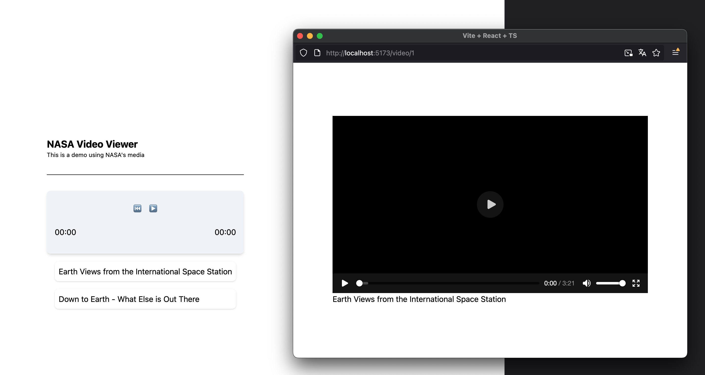
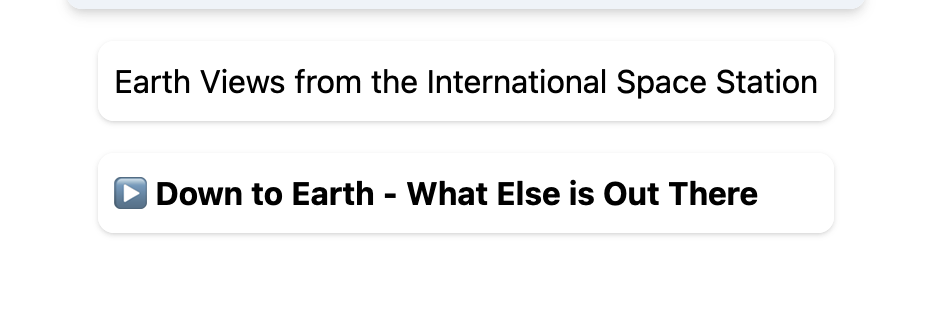

# Synchronizing multiple windows in React

Imagine you have an App that allows you to open a new window with, let's say, a media player. You can play a video there, but you also want to be able to control the media player from the main window. But also, you want to reflect the state of the media player window. How the hell do you accomplish this.

Well, let's take a stab at this, shall we?

## What are we building?

I want to build a simple interface with a list of videos. Each video, when clicked, should open a new window with the native video player. I want the list to reflect which video is playing. I also want to show a smaller remote control on the list view that allows me to control the video in the other window.



## Inter-window communication 

There are a couple of ways you can accomplish this, each one with its caveats. 

The first thing that comes to mind is using `postMessage`, right? Well, this mechanism can be used, of course, but I think there are better suited approaches since this is a unidirectional channel. Another downside is that you have to keep a reference to the window whenever you need to communicate something.

But what other tools do we have in the toolbox? In this post I want to explore `broadcast channel`.

##  Broadcast channel

This browser API allows communication between different windows, iframes, etc. as long as they are on the same origin.

The way a broadcast channel is identified is by a string, so as long as both windows join the same channel, intercommunication is possible.

The way you use it is like this:

```js
// Window A
const bc = new BroadcastChannel("my_channel");
bc.addEventListener("message", (event) => {
	console.log(event.data);
});

// Window B
const bc = new BroadcastChannel("my_channel");
bc.postMessage("Testing 1, 2 ,3...");

// Conceptually, this will show on Window A:
// > Testing 1, 2 ,3...
```

Of course, this is on the traditional Javascript world. We still have to bend it to use it in the React world.

Let's start with our list view. We have mock data with two videos in an array with ids 1 and 2. We will listen for the button click in the list and open the new window in a path and append the id to the path. Internally let's start by storing locally the state:

```tsx
import { useState } from "react";
import { videos } from "../assets/videos";

export function List() {
  const [selectedVideo, setSelectedVideo] = useState<string | null>(null);
  const hndClick = (item: { id: string; file: string }) => () => {
    window.open(
      "/video/" + item.id,
      "_blank",
      "noopener,noreferrer,width=800,height=600,scrollbars=no,resizable=no,toolbar=no"
    );
    setSelectedVideo(item.id);
  };
  return (
    <div className="flex flex-col gap-4 p-4">
      {videos.map((item) => (
        <div
          key={item.id}
          className="p-2 bg-white rounded-lg shadow hover:bg-gray-100"
        >
          <button
            className={`w-full text-left cursor-pointer ${
              selectedVideo === item.id ? "font-bold" : ""
            }`}
            onClick={hndClick(item)}
          >
            {item.title}
          </button>
        </div>
      ))}
    </div>
  );
}

```

Yes, the video highlights, but we can't switch it back to normal once the video closes. We would need to listen for the close event and update the state accordingly. But what if we open a tab manually with the URL. Wouldn't it be awesome if the state updated automagically?

Let's tell the Video window to broadcast whenever it opens.

```tsx
function Video() {
  // Using Tanstack Router, this is how you get the videoId
  const { videoId } = Route.useParams();

  // On mount
  useEffect(() => {
    const bc = new BroadcastChannel('video');
    // post the selected video. Notice the `type` property.
    bc.postMessage({ type: 'videoSelected', videoId });
    return () => {
      bc.close();
    };
  }, [videoId]);

  return (
    // .....
  );
}
```

And now let's listen to this on the List view:

```tsx
export function List() {
  // ...

  useEffect(() => {
    const bc = new BroadcastChannel('video');
    bc.onmessage = (event) => {
      if (event.data.type === 'videoSelected') {
        setSelectedVideo(event.data.videoId);
      }
    };
    return () => {
      bc.close();
    };
  }, [selectedVideo]);

  // ...
}
```

Now you can see that you can remove the setter from the click handler and let the broadcast event to take over. Try opening the video url manually and behold our creation.

Now let's broadcast the play-pause state. For this example, I'm not going to bother with creating a reusable broadcast channel instance since I'm going to clean up the code later. Still, this works perfectly to show how easily we can create new channels and participate in the same communication context.

```tsx
// ...
const hndPlay = () => {
  const bc = new BroadcastChannel('video');
  bc.postMessage({ type: 'videoPlay', videoId });
  bc.close();
};
const hndPause = () => {
  const bc = new BroadcastChannel('video');
  bc.postMessage({ type: 'videoPause', videoId });
  bc.close();
};
return (
  // ...
  <video controls width="640" height="360" onPlay={hndPlay} onPause={hndPause}>
  // ...
);
// ...
```

Then, on the List component we create a new state to store if the video is playing:

```tsx
const [isPlaying, setIsPlaying] = useState(false);
```

And on the list, we listen to the event on the onmessage handler:

```ts
bc.onmessage = (event) => {
  // ...
  if (event.data.type === 'videoPlay') {
    console.log('Video play:', event.data.videoId);
    setIsPlaying(true);
  }
  if (event.data.type === 'videoPause') {
    console.log('Video pause:', event.data.videoId);
    setIsPlaying(false);
  }
}
```

And I'm going to prepend this to the title of the video in the List:

```tsx
  {selectedVideo === item.id && (isPlaying ? "▶️" : "⏸️")} {item.title}
```




We can use the same technique to sync the elapsed time and the length. We just need new events:

```tsx
// ...
const hndCanPlay: ReactEventHandler<HTMLVideoElement> = (e) => {
  postMessage({ type: "videoCanPlay", videoId, duration: e.currentTarget.duration });
};
const hndTimeUpdate: ReactEventHandler<HTMLVideoElement> = (e) => {
  postMessage({ type: "videoTimeUpdate", videoId, currentTime: e.currentTarget.currentTime });
};
return (
  // ...
  <video controls width="640" height="360" onPlay={hndPlay} onPause={hndPause} onCanPlay={hndCanPlay} onTimeUpdate={hndTimeUpdate}>
  // ...
);
// ...
```

Now we can listen to these events in the remote control.

```tsx
export function Player() {
  const [isPlaying, setIsPlaying] = useState(false);
  const [duration, setDuration] = useState(0);
  const [currentTime, setCurrentTime] = useState(0);
  useEffect(() => {
    const bc = new BroadcastChannel("video");
    bc.onmessage = (event) => {
      if (event.data.type === "videoPlay") {
        console.log("Video play:", event.data.videoId);
        setIsPlaying(true);
      }
      if (event.data.type === "videoPause") {
        console.log("Video pause:", event.data.videoId);
        setIsPlaying(false);
      }
      if (event.data.type === "videoCanPlay") {
        console.log("Video can play:", event.data.videoId, "Duration:", event.data.duration);
        setDuration(event.data.duration);
      }
      if (event.data.type === "videoTimeUpdate") {
        console.log("Video time update:", event.data.videoId, "Current time:", event.data.currentTime);
        setCurrentTime(event.data.currentTime);
      }
    };
    return () => {
      bc.close();
    };
  }, []);
  return (
    <div className="bg-slate-100 p-4 rounded-lg shadow-md">
      <div className="flex items-center justify-center mb-4">
        <button className="p-2 rounded-lg hover:bg-slate-200 text-5xl">
          ⏮️
        </button>
        {isPlaying ? (
          <button className="p-2 rounded-lg hover:bg-slate-200 text-5xl">
            ⏸️
          </button>
        ) : (
          <button className="p-2 rounded-lg hover:bg-slate-200 text-5xl">
            ▶️
          </button>
        )}
      </div>
      <div className="flex items-center justify-between mb-4">
        {/* Magic function that formats seconds to 00:00 */}
        <span>{formatDuration(currentTime)}</span>
        <span>{formatDuration(duration)}</span>
      </div>
    </div>
  );
}
```

Now let's send a command to the video window from the remote control to test the bidirectional nature of this channel.

First, we need to make the remote control aware of the currently selected video:

```tsx
export function Player() {
  const [selectedVideo, setSelectedVideo] = useState<string | null>(null);
  // ...
  bc.onmessage = (event) => {
  //...
  if (event.data.type === "videoSelected") {
    console.log("Video selected:", event.data.videoId);
    setSelectedVideo(event.data.videoId);
  }
// ...
}
}
```

Now we post the message.

```tsx
export function Player() {
  // in the remote control
  const hndPlay = () => {
    const bc = new BroadcastChannel('video');
    bc.postMessage({ type: 'remoteVideoPlay', videoId: selectedVideo });
    bc.close();
  };

  const hndPause = () => {
    const bc = new BroadcastChannel('video');
    bc.postMessage({ type: 'remoteVideoPause', videoId: selectedVideo });
    bc.close();
  };

  const hndRewind = () => {
    const bc = new BroadcastChannel('video');
    bc.postMessage({ type: 'remoteVideoRewind', videoId: selectedVideo });
    bc.close();
  };

  return (
    // ...
    <div className="flex items-center justify-center mb-4">
      <button className="p-2 rounded-lg hover:bg-slate-200 text-5xl" onClick={hndRewind}>⏮️</button>
      {isPlaying ? (
        <button className="p-2 rounded-lg hover:bg-slate-200 text-5xl" onClick={hndPause}>⏸️</button>
      ) : (
        <button className="p-2 rounded-lg hover:bg-slate-200 text-5xl" onClick={hndPlay}>▶️</button>
      )}
    </div>
    // ...
  );
}
```

Notice we are posting a different event to distinguish native player changes and the remote control changes to avoid circular dependencies.

Now we listen the message in the Video window and use a ref to the native video component and call its methods.

```tsx
function Video() {
  // Video component
  useEffect(() => {
    const bc = new BroadcastChannel("video");
    bc.onmessage = (event) => {
      console.log("Received message:", event.data);
      if (event.data.type === "remoteVideoPlay" && event.data.videoId === videoId) {
        console.log("Video play:", event.data.videoId);
        videoRef.current?.play();
      }
      if (event.data.type === "remoteVideoPause" && event.data.videoId === videoId) {
        console.log("Video pause:", event.data.videoId);
        videoRef.current?.pause();
      }
      if (event.data.type === "remoteVideoRewind" && event.data.videoId === videoId) {
        console.log("Video pause:", event.data.videoId);
        videoRef.current!.currentTime = 0;
      }
    };
  }, [videoId]);

  return (
    // ...
    <video ... ref={videoRef}>
    // ...
  );
}
```

Important! Since play and pause have to be triggered by a user intention, triggering it before a click will just be ignored.

Another thing I want to implement is a guard to avoid having multiple videos open at the same time since I only have one remote control.

Let's do this by creating a unique name for each window and broadcasting it everywhere. If a Video window receives this message and the id doesn't match, we can close it.

```tsx
function Video() {
  const windowId = useRef(`video-${Math.random().toString(36).substring(2, 15)}`);
  useEffect(() => {
    // ...
    bc.postMessage({ type: 'windowOpened', windowId: windowId.current });
    // ...
  }, []);
  useEffect(() => {
    // ...
    bc.onmessage = (event) => {
      // ...
      if (event.data.type === "windowOpened" && event.data.windowId !== windowId.current) {
        console.log("Another window opened:", event.data.windowId);
        videoRef.current?.pause();
        window.close();
      }
    };
  // ...
  }, [videoId]);
  // ...
}
```

The last thing I want to implement is a mechanism to go back to the "unselected" state. Eg: when there are no video windows.

To do this, we have to broadcast whenever a window closes, so let's add a listener for the beforeunload event and trigger the message there:

```tsx
function Video() {
  // ...
  useEffect(() => {
    window.addEventListener('beforeunload', () => {
      bc.postMessage({ type: 'windowClosed', windowId: windowId.current, videoId });
    });
  }, []);
  // ...
}
```

And let's listen to it in the List component:

```tsx
export function List() {
  // ...
  useEffect(() => {
    // ...
    bc.onmessage = (event) => {
      // ...
      if (event.data.type === "windowClosed") {
        console.log("Window closed:", event.data.windowId);
        setIsPlaying(false);
        setSelectedVideo(null);
      }
    };
    //...
  }, [selectedVideo]);
  // ...
}
```


## Clean up

Now let's clean up the code. Let's encapsulate the broadcast channel so we can reuse a single object. This hook will also take care of exposing a postMessage function and map event handlers.

```tsx
import { useEffect, useRef } from "react";

export function useBroadcastChannel(eventHandlerMap: Record<string, (data: any) => void> = {}) {
  // Single broadcast channel
  const broadcastChannel = useRef<BroadcastChannel | null>(null);

  const postMessage = (message: any) => {
    broadcastChannel.current?.postMessage(message);
  };

  // This message handler will use the `type` to route the message
  // to the correct handler.
  const handleMessage = (event: MessageEvent) => {
    const handler = eventHandlerMap[event.data.type];
    if (handler) {
      handler(event.data);
    }
  };

  // This useEffect hook creates a broadcast channel if there's none
  // and hook the message handler
  useEffect(() => {
    if (!broadcastChannel.current) {
      broadcastChannel.current = new BroadcastChannel("video");
      broadcastChannel.current.onmessage = handleMessage;
    }
    // And let's clean up on unmount
    return () => {
      broadcastChannel.current?.close();
      broadcastChannel.current = null;
    };
  }, []);

  return { postMessage };
}
```

Now, we can use this hook everywhere!

```tsx
// In the List component
export function List() {
  const [isPlaying, setIsPlaying] = useState(false);
  const [selectedVideo, setSelectedVideo] = useState<string | null>(null);
  // ✨ the magic!
  useBroadcastChannel({
    videoSelected: (data: { videoId: string }) => {
      setSelectedVideo(data.videoId);
    },
    videoPlay: () => {
      setIsPlaying(true);
    },
    videoPause: () => {
      setIsPlaying(false);
    },
    windowClosed: () => {
      setIsPlaying(false);
      setSelectedVideo(null);
    },
  });
  const hndClick = (item: { id: string; file: string }) => () => {
    window.open(
      "/video/" + item.id,
      "_blank",
      "noopener,noreferrer,width=800,height=600,scrollbars=no,resizable=no,toolbar=no"
    );
  };
  return (
    <div className="flex flex-col gap-4 p-4">
      {videos.map((item) => (
        <div
          key={item.id}
          className="p-2 bg-white rounded-lg shadow hover:bg-gray-100"
        >
          <button
            className={`w-full text-left cursor-pointer ${
              selectedVideo === item.id ? "font-bold" : ""
            }`}
            onClick={hndClick(item)}
          >
            {selectedVideo === item.id && (isPlaying ? "▶️" : "⏸️")}{" "}
            {item.title}
          </button>
        </div>
      ))}
    </div>
  );
}

```

The the Player component also uses the postMessage function:

```tsx
export function Player() {
  const [duration, setDuration] = useState(0);
  const [currentTime, setCurrentTime] = useState(0);
  const [isPlaying, setIsPlaying] = useState(false);
  const [selectedVideo, setSelectedVideo] = useState<string | null>(null);
  //         👇 to broadcast messages!
  const { postMessage } = useBroadcastChannel({
    videoSelected: (data: { videoId: string }) => {
      setSelectedVideo(data.videoId);
    },
    videoPlay: () => {
      setIsPlaying(true);
    },
    videoPause: () => {
      setIsPlaying(false);
    },
    videoCanPlay: (data: { videoId: string; duration: number }) => {
      setDuration(data.duration);
    },
    videoTimeUpdate: (data: { videoId: string; currentTime: number }) => {
      setCurrentTime(data.currentTime);
    },
    windowClosed: () => {
      setDuration(0);
      setIsPlaying(false);
      setSelectedVideo(null);
    },
  });
  const hndPlay = () => {
    // 💌 Sending the love letter
    postMessage({ type: "remoteVideoPlay", videoId: selectedVideo });
  };
  const hndPause = () => {
    postMessage({ type: "remoteVideoPause", videoId: selectedVideo });
  };
  const hndRewind = () => {
    postMessage({ type: "remoteVideoRewind", videoId: selectedVideo });
  };
  return (
    <div className="bg-slate-100 p-4 rounded-lg shadow-md">
      <div className="flex items-center justify-center mb-4">
        <button
          className="p-2 rounded-lg hover:bg-slate-200 text-5xl"
          onClick={hndRewind}
        >
          ⏮️
        </button>
        {isPlaying ? (
          <button
            className="p-2 rounded-lg hover:bg-slate-200 text-5xl"
            onClick={hndPause}
          >
            ⏸️
          </button>
        ) : (
          <button
            className="p-2 rounded-lg hover:bg-slate-200 text-5xl"
            onClick={hndPlay}
          >
            ▶️
          </button>
        )}
      </div>
      <div className="flex items-center justify-between mb-4">
        <span>{formatDuration(currentTime)}</span>
        <span>{formatDuration(duration)}</span>
      </div>
    </div>
  );
}
```

And this is the Video component

```tsx
function Video() {
  const windowId = useRef(
    `video-${Math.random().toString(36).substring(2, 15)}`
  );
  const videoRef = useRef<HTMLVideoElement>(null);

  // We are using Tanstack Router to get the video id
  const { videoId } = Route.useParams();
  const video = videos.find((v) => v.id === videoId);

  const { postMessage } = useBroadcastChannel({
    remoteVideoPlay: (data: { videoId: string }) => {
      if (data.videoId === videoId) {
        videoRef.current?.play();
      }
    },
    remoteVideoPause: (data: { videoId: string }) => {
      if (data.videoId === videoId) {
        videoRef.current?.pause();
      }
    },
    remoteVideoRewind: (data: { videoId: string }) => {
      if (data.videoId === videoId) {
        videoRef.current!.currentTime = 0;
      }
    },
    windowOpened: (data: { windowId: string }) => {
      if (data.windowId !== windowId.current) {
        videoRef.current?.pause();
        window.close();
      }
    },
  });

  // This useEffect is needed to communicate messages on mount and to
  // listen to the window closing event.
  useEffect(() => {
    postMessage({ type: "windowOpened", windowId: windowId.current });
    postMessage({ type: "videoSelected", videoId });
    window.addEventListener("beforeunload", () => {
      postMessage({
        type: "windowClosed",
        windowId: windowId.current,
        videoId,
      });
    });
  }, [videoId, postMessage]);

  const hndPlay = () => {
    postMessage({ type: "videoPlay", videoId });
  };
  const hndPause = () => {
    postMessage({ type: "videoPause", videoId });
  };
  const hndCanPlay: ReactEventHandler<HTMLVideoElement> = (e) => {
    postMessage({
      type: "videoCanPlay",
      videoId,
      duration: e.currentTarget.duration,
    });
  };
  const hndTimeUpdate: ReactEventHandler<HTMLVideoElement> = (e) => {
    postMessage({
      type: "videoTimeUpdate",
      videoId,
      currentTime: e.currentTarget.currentTime,
    });
  };

  // Safety guard
  if (!video) {
    return <div>Video not found</div>;
  }

  return (
    <div>
      <video
        controls
        width="640"
        height="360"
        onPlay={hndPlay}
        onPause={hndPause}
        ref={videoRef}
        onCanPlay={hndCanPlay}
        onTimeUpdate={hndTimeUpdate}
      >
        <source src={video.file} type="video/mp4" />
        Your browser does not support the video tag.
      </video>

      <div>{video.title}</div>
    </div>
  );
}
```

## Conclusion

The broadcast channel API allows us to communicate multiple windows and iframes very easily. We just have to take into account race conditions and define protocols.

This sample used a happy path, but you can see how this kind of features can grow out of control. I also have a solution for this, but I'll leave it for a follow up post.

